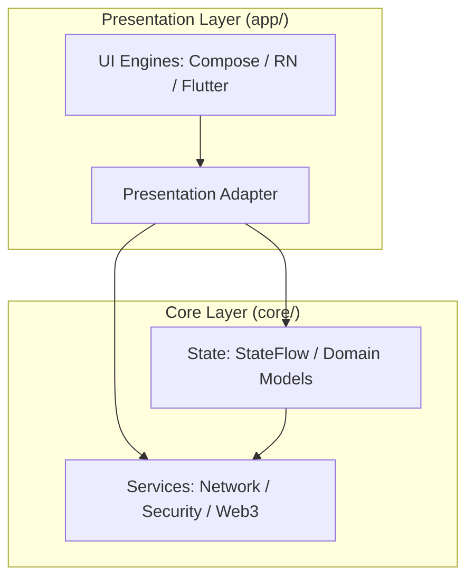

# Mobile Platform Core

`mobile-platform-core` is a **mobile atomized architecture foundation**. Adopting a "UI Engine Agnostic" design philosophy, it aims to build a robust Kotlin core library while supporting **Jetpack Compose**, **React Native**, and **Flutter** with equal integration status.

## Core Vision
- **Single Source of Truth (SSOT)**: All business logic and states are managed by the Kotlin foundation.
- **UI Pluggability**: Rendering engines (Compose/RN/Flutter/H5) serve only as the presentation layer and can be switched freely based on business scenarios.
- **Hardware-Level Security**: Blockchain private keys and sensitive data always remain within the Native secure sandbox.

---

## 🏗 Project Architecture

The project follows a unidirectional dependency flow: **Infrastructure Layer (Core)** -> **Business Logic Layer (State)** -> **Presentation Adapter** -> **Rendering Layer (UI)**.



---

## 📂 Module Responsibility

### 1. app/ - Integration & Orchestration Layer
This layer acts as the product's host, responsible for initializing the core foundation and orchestrating various UI engines.
- **presentation/adapter**: The **Single Point of Consumption**. It transforms `StateFlow` from `Core` into data formats suitable for different UI engines. It acts as a specialized ViewModel layer.
- **presentation/compose**: The high-performance, native Android UI branch using Jetpack Compose.
- **presentation/rn**: The React Native branch, providing dynamic updates and cross-platform flexibility. Includes the Native Bridge logic.
- **presentation/flutter**: A reserved branch for future Flutter integration, ensuring the architecture is truly UI-agnostic.
- **launcher**: The "Brain" of the app shell. It handles splash screens and routing logic, deciding which UI engine to spin up for specific user flows.

### 2. core:state - SSOT & Domain Logic
The "Brain" of the entire system, strictly decoupled from Android UI libraries.
- **Domain Models**: Pure Kotlin classes representing business entities (e.g., `WalletState`).
- **State Management**: Maintains the global **Single Source of Truth**. Whether a value is changed via RN or Compose, it is synchronized here.

### 3. core:services - Atomic Service Layer
Atomic, highly reusable capabilities that focus on "how to do things."
- **network**: Manages RPC communication, API flow scheduling (retry/caching), and the Repository pattern implementation.
- **security**: The "Fortress." Manages hardware-level Keystore keys, biometric prompts, and sensitive data encryption.
- **web3**: Blockchain-specific implementations, encapsulating `web3j` for EVM and `Solana MWA` for Solana.

### 4. build-logic - The Build Engine
A centralized repository for **Convention Plugins**. It ensures all modules follow the same compilation standards, target SDKs, and dependency rules, preventing "Configuration Hell" in a multi-module environment.

---

## 📜 Development Guidelines
1. **Adapter Isolation Principle**: The rendering layer must not operate on Services directly; it must subscribe to states and dispatch commands through the Adapter.
2. **Logic Sinking**: Any logic required by both RN and Compose must be pushed down into `core:state` or `core:services`.
3. **Extensibility First**: All Bridge and Adapter designs should be generic enough to allow rapid integration of new rendering engines (e.g., Flutter).

---

## 🚀 Quick Start
*(Specific build instructions will be added after skeleton initialization)*
```bash
./gradlew :app:assembleDebug
```
