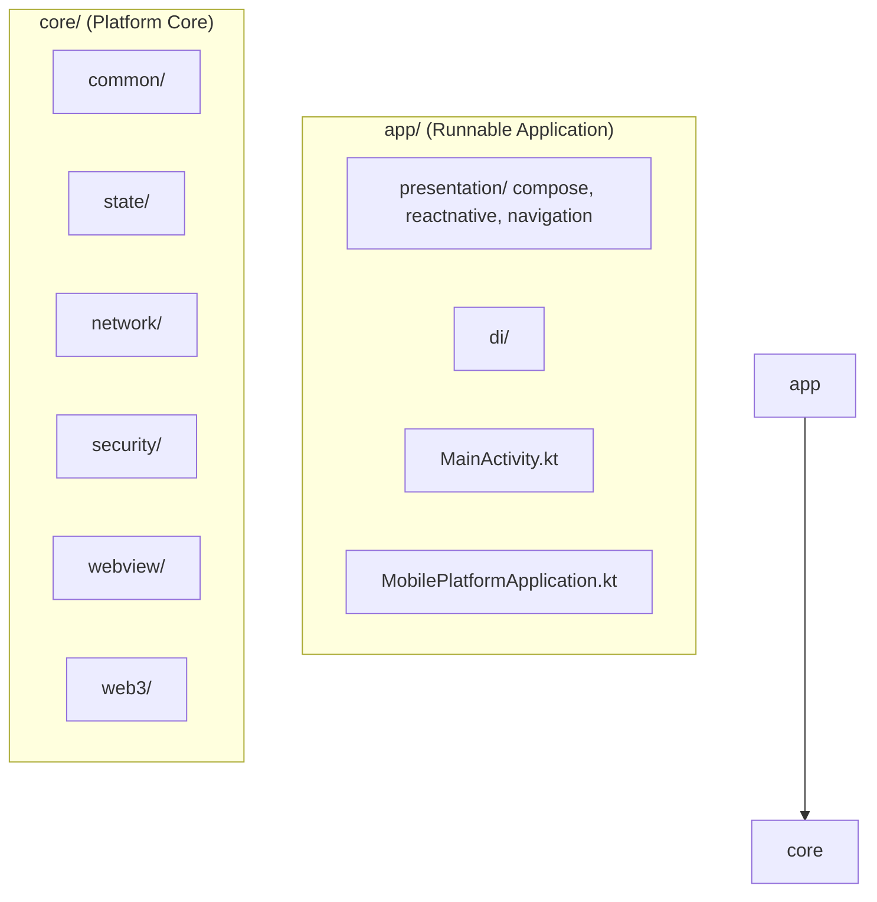

# Mobile Platform Core

`mobile-platform-core` is a **mobile atomized architecture foundation**. It strictly separates the **Runnable Application** from the **Platform Core** services, ensuring high decoupling and modularity.

## 🚀 Getting Started

### Prerequisites
- **JDK 17**: This project requires Java 17 for `web3j` and Java Record support.
- **Android Studio Ladybug (2024.2.1)** or newer.

### Build Configuration
- **Maven Repositories**: The project uses a custom Maven repository (`https://dl.cloudsmith.io/public/consensys/maven/maven/`) to resolve specialized dependencies like `tech.pegasys:jc-kzg-4844`.
- **JDK Desugaring**: Enabled to support modern Java features on older Android versions (Min SDK 24).

---

## 🏗 Project Architecture

---

## 📂 Module Responsibility

### 1. app/ - Runnable Application
The host application that orchestrates platform modules and provides the UI.
- **presentation/**: Contains rendering logic for different engines (Compose, RN).
- **navigation/**: Manages cross-engine and internal routing.
- **di/**: Centralized Dependency Injection configuration.
- **MobilePlatformApplication.kt**: Application entry point.

### 2. core/ - Platform Core
Atomic, domain-specific modules providing the foundation of the platform.
- **common/**: Shared utilities and constants.
- **state/**: Global state management and Domain Models.
- **network/**: RPC and API communication.
- **security/**: Hardware Keystore and biometric services.
- **webview/**: Standardized WebView and JSBridge components.
- **web3/**: EVM, Solana, and other blockchain protocol integrations.

### 3. build-logic/ & gradle/
- **build-logic/**: Convention Plugins for unified build configuration.
- **gradle/libs.versions.toml**: Centralized dependency versioning.

---

## 📜 Development Guidelines
1. **Unidirectional Dependency**: `app` depends on `core`. Modules within `core` should be as independent as possible, communicating via `core:state` or specific interfaces.
2. **SSOT**: `core:state` is the single source of truth for all business logic.
3. **Engine Agnostic**: Keep business logic in `core` and `app/di`, ensuring UI engines in `app/presentation` are just thin consumers.
